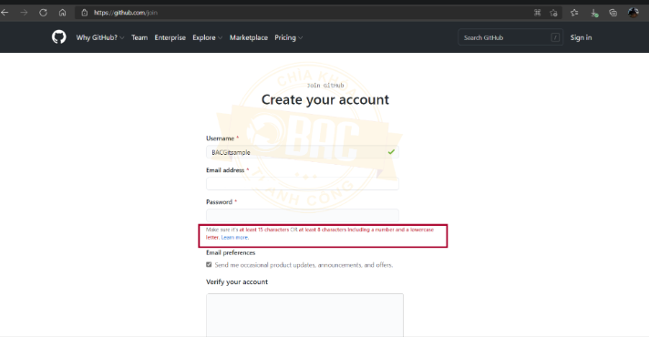

# Project_1  -  Giai đoạn 2

# Github là gì?
GitHub là một dịch vụ lưu trữ trên web dành cho các dự án có sử dụng hệ thống kiểm soát Git revision. Một tài khoản GitHub với nhiều repositories và tham gia vào những project đa dạng khác nhau đem đến cho bạn nhiều lợi ích đáng kể, có thể thay đổi sự nghiệp của bạn.
# Cài đặt và sử dụng
## Tạo tài khoản
Vào đường dẫn https://github.com/join, và nhập Username, email, password



## Cài đặt Git
Vào các đường link sau và tải git về máy:
* MacOS: https://git-scm.com/download/mac
* Window: https://git-scm.com/download/win
* Linux: https://git-scm.com/download/linux

Sau đó cài đặt theo thứ tự
## Các khái niệm cơ bản
Trước khi tìm hiểu về các lệnh cơ bản, bạn nên hiểu các khái niệm cơ bản của Git bạn cần phải nắm:

* Commit: một commit đại diện cho một thời điểm cụ thể trong lịch sử dự án của bạn.
* Branch: bạn có thể hiểu là một nhánh, đại diện cho các phiên bản cụ thể của một kho lưu trữ tách ra từ một project chính.
* Repository: là nơi để lưu trữ mã nguồn, dữ liệu của project (branch, commit, tags)
* Clone: được gọi là nhân bản, hoặc thực hiện nhân bản. Được sử dụng để clone các project, repository, … Việc clone này sẽ cho phép bạn sao chép repository tại commit mong muốn, dung để tiếp tục phát triển. Thao tác này sẽ tải toàn bộ dữ liệu, mã nguồn về máy tính của bạn
## Các câu lệnh Git cơ bản
Cơ chế hoạt động của Git:

* git init: Cho phép bạn khởi tạo 1 git repository 1 project mới hoặc đã có.
Cách dùng: git init trong thư mục gốc của project
* git clone: Cho phép bạn copy 1 git repository từ remote source.
> Cách dùng: git clone <:url cần clone:>
* Git pull: Pull các thay đổi đến remote
> Cách dùng: git pull <:remote:> <:branch:>
git add và git add.: Để đưa một tập tin vào Staging Area
> Cách dùng: git add tên_file_cần_add
Nếu bạn muốn thêm hết file thì dung: git add all
* git commit:
> Cách dùng: git commit -m “Ở đây bạn lưu lại tin nhắn dùng để note lại các thay đổi để tiện theo dõi”
* git push: push các thay đổi đến remote
> Cách dùng: git push <:remote:> <:branch:>
gitlog -decorate -graph -oneline

# Đánh giá
## Ưu điểm
* Dễ dàng quản lý Source Code: Khi bạn tạo repo, toàn bộ thành quả sẽ được lưu trên công cụ này và bạn có thể theo dõi lại quá trình mình đã làm việc. 
* Tracking những thay đổi qua các version: GitHub cho phép bạn theo dõi tất cả các thay đổi của từng phiên bản của mã nguồn.
* Markdown: GitHub sử dụng Markdown, một ngôn ngữ đánh dấu để ghi chú và giải thích code.
* Khẳng định chuyên môn: Với GitHub, các lập trình viên có thể chứng minh khả năng của mình với các dự án mà họ đã làm, giúp cải thiện khả năng code của mỗi developer trong một dự án.
* Kho tài nguyên tuyệt vời: Github cung cấp nhiều tài liệu hướng dẫn và mã nguồn miễn phí cho cộng đồng lập trình viên.
* GitHub Action: GitHub Action là một tính năng mới được giới thiệu vào năm 2019, giúp tự động hóa các công việc liên quan đến phát triển phần mềm trên GitHub.
* Github Package Registry: Đây là một tính năng mới của GitHub, cho phép lưu trữ và quản lý các gói phần mềm khác nhau. Nó giúp các developer dễ dàng chia sẻ và tái sử dụng code.
* Mở rộng quan hệ: GitHub cũng cho phép bạn mở rộng quan hệ với các developer khác, thông qua việc theo dõi hoặc tham gia các dự án của họ.

# Nhược điểm
* Không phù hợp cho các dự án lớn: Với các dự án lớn, việc quản lý có thể trở nên phức tạp và khó khăn.
* Bạn phải biết Git để sử dụng: GitHub được xây dựng trên nền tảng Git, do đó nếu bạn không quen thuộc với Git, sẽ khó khăn để sử dụng GitHub hiệu quả.
* Phải trả phí cho các tính năng cao cấp: Một số tính năng của GitHub chỉ có sẵn cho phiên bản trả phí, do đó nếu bạn muốn sử dụng các tính năng này, bạn sẽ phải trả phí.
## Tìm hiểu Markdown
https://www.youtube.com/watch?v=jJky0Ws9xKg&t=19s

## Tìm hiểu Realease
https://viblo.asia/p/tao-tag-trong-git-va-tao-release-tren-github-eW65G7Yj5DO

# Viết Markdown cho các bài tập ở tuần 1
## Week 1

### Problem 1: Sum Array

Given a sequence of integers a1, a2, ..., an. Compute the sum Q of elements of this sequence.
 
 ### Source code
 ```
 //C/C++ 
#include <bits/stdc++.h> 

int main() 
{ 
    int n;
    std::cin >> n;
    int a[n];
    for(int i = 0;i < n;i++){
        std::cin >> a[i];
    }
    int sum = 0;
    for(int i = 0;i < n;i++){
        sum += a[i];
    }
    std::cout << sum;
}

 ```
### Problem 2: List sequence of integer having 3 digits divisible by n


Given a positive integer n, find all integer having 3 digits which is divisible by n.

### Source code

```
//C/C++ 
#include <bits/stdc++.h> 

int main() 
{ 
    int n;
    std::cin >> n;
    for(int i = 100;i <= 999;i++){
        if(i % n == 0){
            std::cout << i <<" ";
        }
    }
}

```

### Problem 3: Compare the difference in electricity prices according to EVN's new proposal

Currently, electricity prices are calculated according to a ladder of 6 levels (adjusted from May 4, 2023), with the lowest price (level 1) being 1,728 VND and the highest price being 3,015 VND. However, EVN is proposing a new step-by-step method of calculating electricity prices including only 5 levels as shown below, the lowest price (level 1) is about 1,728 VND per kWh and the highest (level 5) is 3,457 VND per kWh.

### Source code

```
//C++ 
#include <bits/stdc++.h> 
#include<iomanip>
#include<iostream>
int main() 
{ 
    int Ecount;
    std::cin >> Ecount;
    double price;
    if(Ecount <= 50){
        price = 0;
    }
    else if(Ecount <= 100){
        price = -1.1*(1.728*50 + 1.786*(Ecount - 50) - 70*1.728)*1000;
    }
        else if(Ecount <= 300){
            price = -1.1*(1.728*50+1.786*50-1.728*100)*1000;
        }
            else if(Ecount <= 400){
                price = -1.1*(50*1.728+50*1.786-100*1.728+100*2.612+(Ecount-300)*2.919-(Ecount-200)*2.612)*1000;
            }
                else if(Ecount <= 700){
                    price = -1.1*(50*1.728+50*1.786+100*2.919-100*2.612-100*1.728+(Ecount-400)*(3.015-3.111))*1000;
                }
                    else
                        price = -1.1*(50*1.728+50*1.786+100*2.919-100*2.612-100*1.728+(Ecount-400)*3.015-300*3.111-(Ecount-700)*3.457)*1000;
    std::cout << std::fixed << std::setprecision(2) << price;
}

```

### Problem 4: Convert a TEXT to Upper-Case


Given a TEXT, write a program that converts the TEXT to upper-case. 

### Source code
```
#include <bits/stdc++.h>

using namespace std;
string text;

int main()
{
    while (getline(cin, text))
    {
        transform(text.begin(), text.end(), text.begin(), ::toupper);
        cout << text << endl;
    }
    return 0;
}
```

### Problem 5: Extract Year, Month, Date from a String YYYY-MM-DD

Given a date which is a string under the format YYYY-MM-DD (in which YYYY is the year, MM is the month (the month is from 1 to 12), and DD is the date (the date is from 1 to 31)). Extract the year, month and date.
### Source code
```
#include <iostream>
#include <sstream>
#include <vector>

bool isValidDateFormat(const std::string& date) {
    if (date.length() != 10 || date[4] != '-' || date[7] != '-') {
        return false;
    }

    std::string dayStr = date.substr(8, 2);
    std::string monthStr = date.substr(5, 2);
    std::string yearStr = date.substr(0, 4);

    // Xóa kí tự '0' ở đầu của ngày và tháng nếu có
    if (dayStr[0] == '0') {
        dayStr = dayStr.substr(1);
    }

    if (monthStr[0] == '0') {
        monthStr = monthStr.substr(1);
    }

    int day = std::stoi(dayStr);
    int month = std::stoi(monthStr);
    int year = std::stoi(yearStr);

    if (month < 1 || month > 12) {
        return false;
    }

    // Kiểm tra tính hợp lệ của ngày dựa trên giá trị tháng và năm
    bool isLeapYear = (year % 4 == 0 && year % 100 != 0) || (year % 400 == 0);
    int daysInMonth = 31;

    if (month == 4 || month == 6 || month == 9 || month == 11) {
        daysInMonth = 30;
    } else if (month == 2) {
        daysInMonth = isLeapYear ? 29 : 28;
    }

    if (day < 1 || day > daysInMonth) {
        return false;
    }

    return true;
}

std::vector<std::string> extractDateParts(const std::string& date) {
    std::vector<std::string> parts;
    std::istringstream iss(date);
    std::string part;

    while (getline(iss, part, '-')) {
        parts.push_back(part);
    }

    return parts;
}

int main() {
    std::string date;
    std::getline(std::cin, date);

    if (!isValidDateFormat(date)) {
        std::cout << "INCORRECT" << std::endl;
    } else {
        std::vector<std::string> parts = extractDateParts(date);

        // Xóa kí tự '0' ở đầu của ngày và tháng nếu có
        for (std::string& part : parts) {
            if (part.size() > 1 && part[0] == '0') {
                part = part.substr(1);
            }
        }

        for (const std::string& part : parts) {
            std::cout << part << " ";
        }
        std::cout << std::endl;
    }

    return 0;
}

```

### Problem 6: List all numbers from 1 to n and its squares

Each line i (i = 1,...,n): contains i and i^2 (elements are separated by one SPACE character)

### Source code
```
//C++ 
#include <bits/stdc++.h> 

int main() 
{ 
    int n;
    std::cin >> n;
    for(int i = 1;i <= n;i++){
        std::cout << i << " " << i*i << std::endl;
    }
}
```
### Problem 7: Count odd and even number from a sequence

Given a sequence of integer a1, a2, ..., an. Count the number of odd elements and even elements of the sequence.
```
#include<bits/stdc++.h>

int main(){
    int n;
    std::cin >> n;
    int a[n];
    for(int i = 0;i < n;i++){
        std::cin >> a[i];
    }
    int count1 = 0,count2 = 0;
    for(int i = 0;i < n;i++){
        if(a[i] % 2 != 0)
            count1++;
        else
            count2++;
    }
    std::cout << count1 << " " << count2;
}

```

### Problem 8: Add Subtract Multiplication Division of A and B

Given 2 integers a and b. Compute a+b, a-b, a*b, a/b.
```
//C++ 
#include <bits/stdc++.h> 

int main() 
{ 
    int a,b;
    std::cin >> a >> b;
    std::cout << a+b << " " << a-b << " " << a*b << " " << a/b;
}

```
### Problem 9: Solve degree-2 polynomial equation

Given an equation ax^2 + bx + c = 0. Find solution to the given equation.
```
#include<bits/stdc++.h>
#include<iomanip>

int main(){
    double a,b,c;
    std::cin >> a >> b >> c;
    double delta = b*b - 4*a*c;
    if(delta < 0){
        std::cout << "NO SOLUTION";
    }
    else if(delta == 0){
        std::cout << std::fixed << std::setprecision(2) << (-b)/(2*a);
    }
        else{
            delta = sqrt(delta);
            double x1 = (-b-delta)/(2*a),x2 = (-b+delta)/(2*a);
            if(x1 < x2)
                std::cout << std::fixed << std::setprecision(2) << x1 << " " << x2;
            else 
                std::cout << std::fixed << std::setprecision(2) << x2 << " " << x1;
        }
}

```